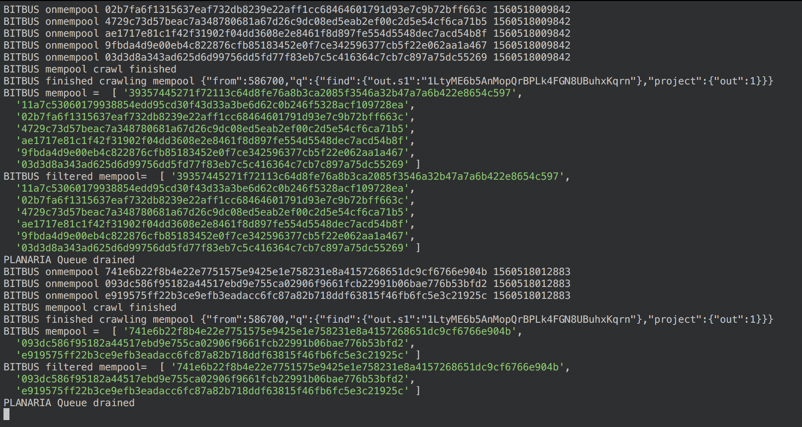
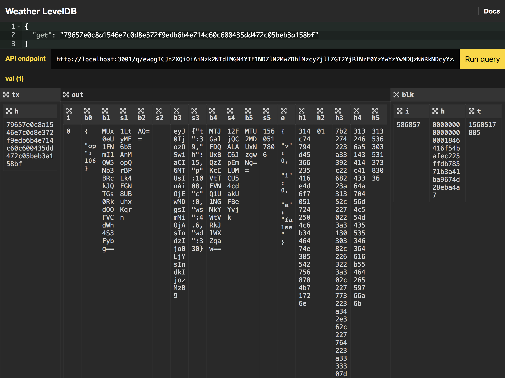

# Neon Planaria LevelDB

A simple LevelDB running on [Neon Planaria](https://neon.planaria.network)

# How to run

Step 1. Clone the project

```
git clone https://github.com/interplanaria/neonlevel.git
```

Step 2. Install dependencies

```
npm install
```

Step 3. Start Planaria

```
node index
```

You will see that, at first Bitbus starts synchronizing. And after that's done, Planaria will start synchronizing with Bitbus. 



> If you want to see the result faster, you may want to tweak the ["from"](https://github.com/interplanaria/neonlevel/blob/master/index.js#L8) attribute to start crawling from later height

Step 4. Start Planarium

After Planaria finishes synchronizing, open Planarium with:

```
node server
```

You will see a home page with "Open explorer" button. Click it, and you'll be welcomed with an empty explorer:


Try typing entering a query:

```
{
  "get": "79657e0c8a1546e7c0d8e372f9edb6b4e714c60c600435dd472c05beb3a158bf"
}
```

You'll see the result:



> Remember, YOU can design this query language yourself. And this demo code shows you how this is done.


# How it works

## Planaria (WRITE)

### 1. LevelDB

On the WRITE side (`index.js`), the app takes WeatherSV dataset and inserts them into LevelDB.

### 2. Only Output

This app only replicates the `output` of each relevant transaction through [bitbus](https://bitbus.network).


## Planarium (READ)

### 1. Interlevel

On READ side (`server.js`), the app accesses the stored LevelDB instance through a library called [Interlevel](https://github.com/interplanaria/interlevel).

This is needed because LevelDB on its own is not thread safe. Interlevel lets you set up a ZeroMQ server and send `get` and `put` queries over Zeromq and get response back through the same channel.

### 2. Default Query

It also utilizes the `default` attribute, which is the default JSON query that gets displayed when the explorer is opened for the first time.

